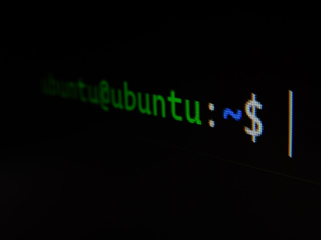

# cli-awesomeness

Useful stuff for the command line (CLI)



Photo by [Gabriel Heinzer](https://unsplash.com/@6heinz3r?utm_content=creditCopyText&utm_medium=referral&utm_source=unsplash) on [Unsplash](https://unsplash.com/photos/green-and-black-digital-device-xbEVM6oJ1Fs?utm_content=creditCopyText&utm_medium=referral&utm_source=unsplash)


## Configuration

Assuming that you're using `bash`, add the following lines to `.bash_profile`:
```
export PATH_CLIA=[path_to_local_folder_of_cli-awesomeness]
export PATH_CLIA_SCRIPTS=$PATH_CLIA/scripts
export PATH_CLIA_CONFIG=$PATH_CLIA/config

source $PATH_CLIA_CONFIG/.aliases
```

Install the python package `cliapy` (in editable mode):
```
pip install -e cliapy
```

## How to use `cliapy`

Example:
```
> touch my_awesome_file.txt
> add_date my_awesome_file.txt 
> ls
2024_07_28_my_awesome_file.txt
```

## tmux

Create a symbolic link to load `.tmux.conf`
```
ln -s config/.tmux.conf ~/.tmux.conf
```
