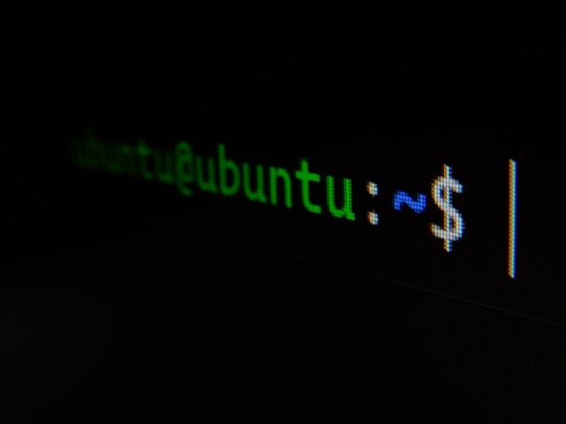

# cli-awesomeness

Useful stuff for the command line (CLI)

Photo by [Gabriel Heinzer](https://unsplash.com/@6heinz3r?utm_content=creditCopyText&utm_medium=referral&utm_source=unsplash) on [Unsplash](https://unsplash.com/photos/green-and-black-digital-device-xbEVM6oJ1Fs?utm_content=creditCopyText&utm_medium=referral&utm_source=unsplash)

## config

Config files aka dot files:

- [aliases](config/aliases): useful aliases
- [bash_profile](config/bash_profile): sourcing [bashrc](config/bashrc)
- [bashrc](config/bashrc): useful bash customization
- [bash_profile](config/bash_profile): useful aliases
- [screenrc](config/screenrc): `screenrc` customization
- [tmux.conf](config/tmux.conf): `tmux` customization

